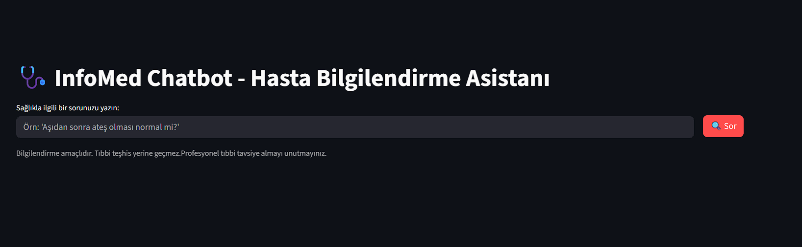

# 🧠 InfoMedChatbot — RAG Tabanlı Sağlık Bilgi Asistanı

## 📌 Projenin Amacı
Bu proje, **Retrieval-Augmented Generation (RAG)** mimarisi kullanılarak geliştirilmiş bir **sağlık bilgi chatbotu**dur.  
Amaç, kullanıcıların sağlıkla ilgili (örneğin semptom, tedavi, hastalık vb.) sorularına **doğru ve kaynak destekli** yanıtlar sunmaktır.  
Model, kullanıcıdan gelen soruyu anlamlandırır, ilgili bilgiyi **vektör veritabanından (ChromaDB)** çağırır ve **Google Gemini API** yardımıyla doğal dilde yanıt üretir.

---

## 📂 Veri Seti Hakkında
Proje kapsamında kullanılan veri seti, açık kaynaklı sağlık makaleleri ve tıbbi bilgi metinlerinden oluşturulmuştur.  
Veri içeriği şunları kapsar:
- Yaygın hastalıklar ve belirtileri  
- Tedavi yöntemleri  
- Sağlıkla ilgili genel bilgiler  

Veri, `.txt` formatında kaydedilmiş ve **embedding** işlemiyle vektörlere dönüştürülmüştür.   

---

## 🧩 Kullanılan Teknolojiler ve Yöntemler

| Bileşen | Teknoloji | Açıklama |
|----------|------------|-----------|
| **LLM (Dil Modeli)** | Google Gemini 1.5 Flash | Metin üretimi ve anlama |
| **Embedding Model** | `text-embedding-004` | Metinleri sayısal vektörlere dönüştürür |
| **Veritabanı** | ChromaDB | Bilgi geri çağırma için vektör arama |
| **RAG Framework** | LangChain | Retrieval + Generation pipeline |
| **Arayüz** | Streamlit | Web tabanlı kullanıcı arayüzü |
| **Dağıtım** | Streamlit Cloud | Uygulamanın canlıya alınması |

---

## 🏗️ Çözüm Mimarisi

```
Kullanıcı Sorusu
       │
       ▼
   Embedding Model
       │
       ▼
   Vektör Arama (ChromaDB)
       │
       ▼
   Gemini LLM
       │
       ▼
   Yanıt Üretimi
```

Bu yapı sayesinde chatbot, hem **bilgi tabanlı doğruluk** hem de **LLM’in doğal dil üretme gücünü** birleştirir.

---

## ⚙️ Kurulum ve Çalıştırma Kılavuzu

### 1️⃣ Ortam Kurulumu
```bash
git clone https://github.com/eminemtnn27/InfoMedChatbot.git
cd InfoMedChatbot
python -m venv venv
venv\Scripts\activate      # Windows
# veya source venv/bin/activate  # Mac/Linux
```

### 2️⃣ Gerekli Kütüphaneler
```bash
pip install -r requirements.txt
```

### 3️⃣ API Anahtarı Ekleme

#### 🔐 Lokal ortamda:
Proje dizinine `.env` dosyası oluşturup aşağıdakini ekleyin:
```env
GOOGLE_API_KEY=senin-api-key
```

#### ☁️ Streamlit Cloud üzerinde:
> “Advanced Settings → Secrets” alanına şunu ekle:
```toml
GOOGLE_API_KEY = "senin-api-key"
```

---

## ▶️ Uygulamayı Çalıştırma
```bash
streamlit run app.py
```

Uygulama yerel olarak şu adreste açılır:
```
http://localhost:8501
```

---

## 🌐 Web Arayüzü
**Canlı Uygulama Linki:** [https://infomedchatbot.streamlit.app](https://infomedchatbot.streamlit.app)

**Arayüz Özellikleri:**
- Kullanıcı metin tabanlı soru girişi yapar  
- Model RAG pipeline’ını çalıştırır  
- Bilgi tabanından alınan yanıtı doğal dilde sunar  

📸 *Örnek Görsel:*  


---

## 📊 Elde Edilen Sonuçlar
- Chatbot, sağlık temalı sorulara doğru ve tutarlı cevaplar üretir.  
- RAG yaklaşımı sayesinde **yanıltıcı üretim oranı (“hallucination”) önemli ölçüde azaltılmıştır.**  
- Vektör arama ile **semantik benzerlik** tabanlı bilgi geri çağırma yapılır.  

---

## 📚 Kaynaklar
- [Gemini API Docs](https://ai.google.dev/gemini-api/docs)  
- [Gemini API Cookbook](https://ai.google.dev/gemini-api/cookbook)  
- [LangChain](https://www.langchain.com/)  
- [ChromaDB](https://www.trychroma.com/)  
- [Streamlit](https://docs.streamlit.io/)  
- [Haystack](https://haystack.deepset.ai/)

  
> Bu proje, RAG mimarisi ile LLM'i birleştirerek kullanıcıların sağlık bilgisini elde etmelerini sağlar.
